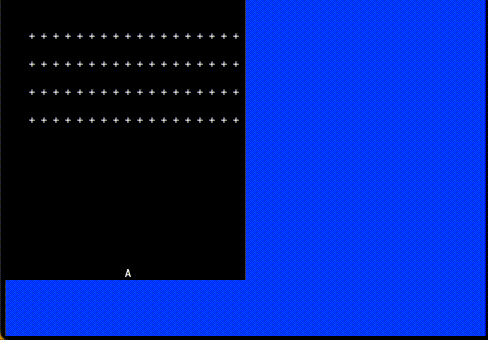

# Space Invaders Clone

The game has been created following the [Ultimate Rust Crash Course](https://www.udemy.com/course/ultimate-rust-crash-course/) programming course by [Nathan Stocks](https://github.com/CleanCut).

### Built With

- [Rust Programming Language](https://www.rust-lang.org/)

<!-- USAGE EXAMPLES -->

## Usage

To play the game simply run:
`cargo run`

## Control

- `Left` - move ship left,
- `Right` - move ship right,
- `Space` / `Enter` - fire,
- `q` / `Esc` - terminate game.

<!-- LICENSE -->

## License

Please reference to original [LICENSE](https://github.com/CleanCut/invaders/#license). Idea & sounds provided by [Nathan Stocks](https://github.com/CleanCut).

<!-- ACKNOWLEDGMENTS -->

## Acknowledgments

- [Ultimate Rust Crash Course](https://www.udemy.com/course/ultimate-rust-crash-course/) by [Nathan Stocks](https://github.com/CleanCut).
